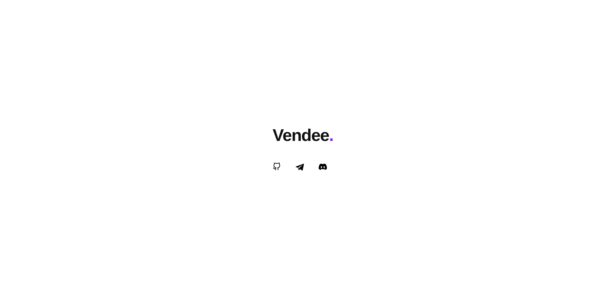
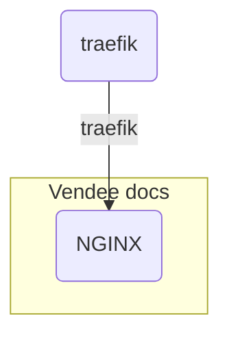

# Documentation




[vendee.top](https://vendee.top)

## Start development

```shell
docker compose up
```

## Deploy on server

### Set secrets

* `SSH_DEPLOY_PRIVATE_KEY` - e.g. `AAAwEAA ...`

### Push code and check GitHub actions

[GitHub action](https://github.com/kokkekpek/vendee-docs/actions/workflows/deploy.yaml)

## Docker network scheme


